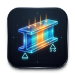
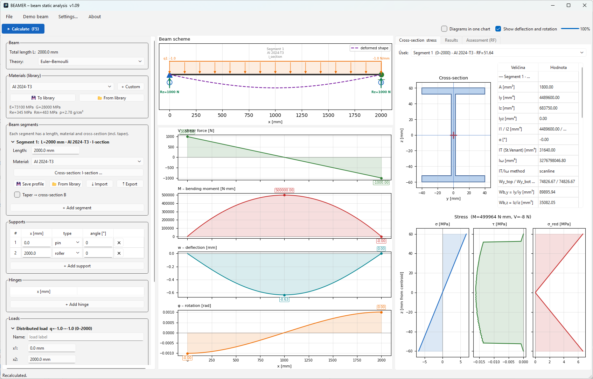

<h1>
  
  BEAMER
</h1>

**Desktop application for static analysis of a straight beam and stress
evaluation across the cross-section.** Built for structural / strength
engineering work: internal forces, deflection, accurate section properties and
reserve-factor assessment.

Python · PySide6 · NumPy · Matplotlib · SciPy.

[](https://github.com/mrSpringpeace/BEAMER/actions/workflows/tests.yml)

> ⚠️ This repository is **read-only**. Issues are welcome, but external pull
> requests are not accepted at this time.



> ### ⚠️ Disclaimer
>
> BEAMER is an **engineering aid and learning tool**, not a certified design
> tool. It is provided **as is**, without any warranty (see [LICENSE](LICENSE)).
> Results may contain errors. **Always verify any result with an independent
> method** before using it in design, analysis or certification. The author
> accepts no responsibility for decisions made on the basis of its output.

---

## Features

- **Beam solver** — direct stiffness method (4 DOF per node: axial *u*,
  transverse *w*, bending rotation *φ*, torsion *θ*). Handles statically
  indeterminate beams; choice of **Euler–Bernoulli** or **Timoshenko** theory.
  The mesh is refined automatically for accurate deflection under distributed
  loads.
- **Internal forces & deformations** — axial force *N*, shear *V*, bending
  moment *M*, torsion *Mk*, deflection *w* and rotation *φ* along the beam,
  with extrema marked on the diagrams.
- **Segment-based model** — the beam is built from segments; each segment has
  its own **length**, **material** (from the library) and **cross-section**
  (including tapered transitions). The solver uses per-segment *E*, *G* and
  material strengths (*Re*, *Rm*).
- **Cross-section library** — rectangle, hollow rectangle (RHS), circle, tube
  (CHS), I, T, L, U/C, an arbitrary **polygonal** section, and a section defined
  directly by its moment of inertia *Iy*.
- **Composite (multi-body) sections** — a section may contain several separate
  bodies, each with its own outline and any number of holes. The whole assembly
  is evaluated as one section (composite *A*, *Iy*, *Iz*, *IT*).
- **Accurate section properties** — area *A* and moments *Iy*, *Iz*, *Iyz* from
  the exact Green's-theorem integration; torsion constant *IT*, warping constant
  *Iω*, shear-center location and effective shear areas from a finite-element
  **Saint-Venant solver** (quadratic T6 triangles). Principal moments, radii of
  gyration, section moduli and plastic moduli are reported as well.
- **Stress & assessment** — normal and shear stress, von Mises equivalent
  stress, and the **reserve factor (RF)** against yield and ultimate strength
  along the entire beam (RF ≥ 1 means the section passes).
- **Material library** — common aerospace alloys and steel; custom materials
  with arbitrary *E*, *G*, *ν*, *Re*, *Rm*, *ρ*.
- **Files & export** — human-readable JSON projects, text report export and PNG
  export of the diagrams.
- **Bilingual UI** — English / Czech (switchable in Settings).

---

## Installation

Requires **Python 3.10+**.

```bash
pip install -r requirements.txt
```

Dependencies: PySide6, NumPy, Matplotlib, SciPy.

> SciPy is required for the exact FEM torsion / warping properties of arbitrary
> (polygonal) sections. Without it, those properties fall back to approximate
> estimates.

## Running

```bash
python main.py
```

On Windows you can also use `BEAMER.bat`, which launches the app without a
console window.

To package BEAMER into a single standalone `.exe`, see
[BUILD_EXECUTABLE.md](BUILD_EXECUTABLE.md).

---

## Documentation

A full user manual is available:
[manual/BEAMER_manual_EN_v1.12.docx](manual/BEAMER_manual_EN_v1.12.docx).

## Tests

A verification suite checks the results against closed-form solutions
(cantilever / simply supported / fixed-fixed beams, torsion, Timoshenko vs
Euler–Bernoulli, stress sign convention):

```bash
pip install -r requirements-dev.txt
python -m pytest beamer/tests/ -v
```

---

## How it works (short)

The beam is solved as a planar frame element by the direct stiffness method and
discretized at supports, hinges, loads and segment boundaries. Section
properties combine an exact Green's-theorem evaluation of *A*, *Iy*, *Iz*,
*Iyz* with a FEM Saint-Venant solution for torsion, warping, shear center and
shear areas. Stress is assembled from the internal-force contributions
(σ = N/A + M·z/Iy, τ = V·Q/(Iy·b) + Mk·t/IT, …) and reduced by the von Mises
criterion; the reserve factor is RF = min(Re, Rm)/σ_red.

---

## Validation

Section properties are checked against closed-form analytical values. Area and
moments of inertia (*A*, *Iy*, *Iz*, *Iyz*) come from exact Green's-theorem
integration and match analytical results to machine precision; torsion,
warping and shear-center quantities come from the FEM solver and show the small
mesh-dependent deviations expected of a discretized solution.

| Case | Quantity | Analytical | BEAMER |
|------|----------|-----------:|-------:|
| Rectangle 100 × 60 mm | *A* | 6 000 mm² | 6 000 |
| | *Iy* = b·h³/12 | 1 800 000 mm⁴ | 1 800 000 |
| | *Iz* = h·b³/12 | 5 000 000 mm⁴ | 5 000 000 |
| Square 100 × 100 mm, centered 40 × 40 hole | *A* | 8 400 mm² | 8 400 |
| | *Iy* = *Iz* = (100⁴ − 40⁴)/12 | 8 120 000 mm⁴ | 8 120 000 |
| Composite: two 100 × 20 flanges at z = ±90 mm | *A* | 4 000 mm² | 4 000 |
| | *Iy* = 2·(b·t³/12 + A·d²) | 32 533 333 mm⁴ | 32 533 333 |
| | centroid / shear center | (0, 0) | (0, 0) |

The FEM Saint-Venant core (torsion constant *J/IT*, warping constant *Iω*,
shear center, shear areas) follows the formulation in
W. D. Pilkey, *Analysis and Design of Elastic Beams* (Wiley, 2002), and was
cross-checked against reference section-property tools.

This is a starting set, not exhaustive coverage. If you find a case where the
output disagrees with a trusted reference, please open an issue.

---

## License

Licensed under the **Apache License 2.0** — see [LICENSE](LICENSE).
Copyright © 2026 mrSpringpeace.
